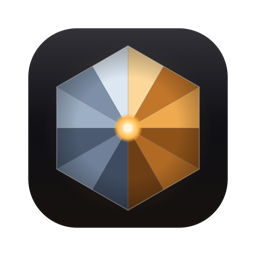

<p align="center">
  
</p>

<h1 align="center">ORE</h1>

<p align="center">
  <strong>Run coding agents in parallel, review their diffs, and ship pull requests. A native Mac app.</strong>
</p>

<p align="center">
  <a href="https://github.com/OpenResearchh/ore/releases/latest"></a>
  <a href="LICENSE"></a>
  
  
  <a href="https://github.com/OpenResearchh/ore/actions/workflows/orekit.yml"></a>
</p>

---

ORE gives every task its own git worktree and its own agent. Claude Code, Codex
or cursor-agent works in each one. You follow the transcripts, comment directly
on diff lines, and take each change through commit, PR and merge without
leaving the app.

It runs the agent CLIs you already have, on **your existing subscriptions**.
ORE never handles API keys.

## Features

- **Parallel workspaces.** Each task gets an isolated worktree. Start from a
  branch, an issue, a PR, or on top of another workspace.
- **Review built in.** Live diffs, syntax highlighting, image and HTML
  previews, and comments on diff lines that go straight to the agent.
- **Checkpoints.** Roll back the files and the conversation to any turn.
- **Safe by default.** A repository's `ore.toml` setup and archive scripts run
  only after you've read and allowed them, and an edited script asks again.
- **One-click shipping.** A suggested next step (commit, push, open a PR, fix
  CI, merge) that also works for stacked branches.
- **Terminal and search.** A shell in every workspace, and full-text search
  over every transcript.

## Install

```sh
brew install openresearchh/tap/ore
```

Or use `curl -fsSL https://openresearchh.com/ore/install.sh | sh`, or download
the DMG from [Releases](https://github.com/OpenResearchh/ore/releases/latest).

**Requirements:** macOS 14 or later on Apple Silicon, `git`, and at least one
signed-in agent CLI:
[Claude Code](https://docs.anthropic.com/en/docs/claude-code),
[Codex](https://github.com/openai/codex) or
[cursor-agent](https://cursor.com/install). For pull requests you also need
the [GitHub CLI](https://cli.github.com).

> ORE isn't notarized yet. The two commands above install it without any
> warning. If you use the DMG, allow it once under **System Settings → Privacy
> & Security**.

## Build from source

Requires Xcode 26.

```sh
git clone https://github.com/OpenResearchh/ore.git
cd ore/Apps/OreMac
./Scripts/bundle.sh && open .build/ORE.app
```

Run the tests with `swift test` in `Packages/OreKit`, and with
`xcrun --sdk macosx swift test` in `Apps/OreMac`.

## Project layout

| Path | What it is |
|---|---|
| [`Packages/OreKit`](Packages/OreKit) | Headless core: agent drivers, git, persistence, `ore-cli` |
| [`Apps/OreMac`](Apps/OreMac) | The SwiftUI app |
| [`packaging`](packaging) | Homebrew cask and installer tests |

## Contributing

Issues and pull requests are welcome. See [CONTRIBUTING.md](CONTRIBUTING.md).
Please report security issues privately, as described in
[SECURITY.md](SECURITY.md). [PRIVACY.md](PRIVACY.md) covers exactly what ORE
reports: a few anonymous usage events that you can switch off, and never your
code or prompts.

## License

Copyright 2026 Jupiter Innovations Lab Inc. Licensed under the
[Apache License 2.0](LICENSE). Third-party components are listed in
[NOTICE](NOTICE).

Claude, Codex and Cursor are trademarks of their respective owners. ORE is not
affiliated with or endorsed by them.
